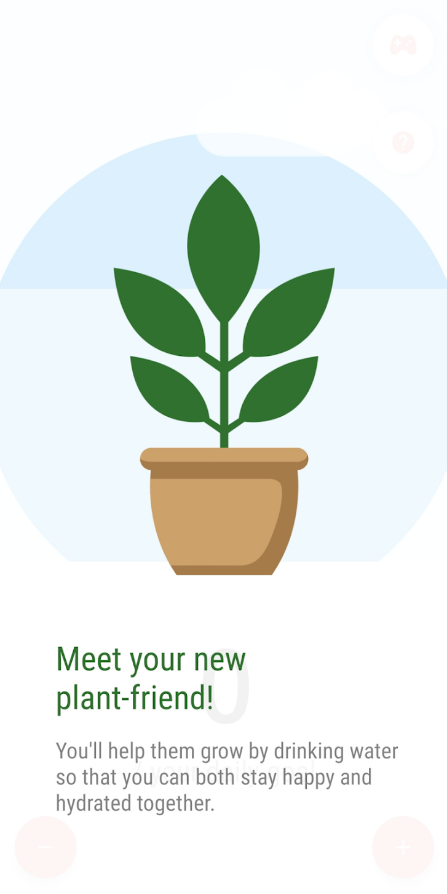
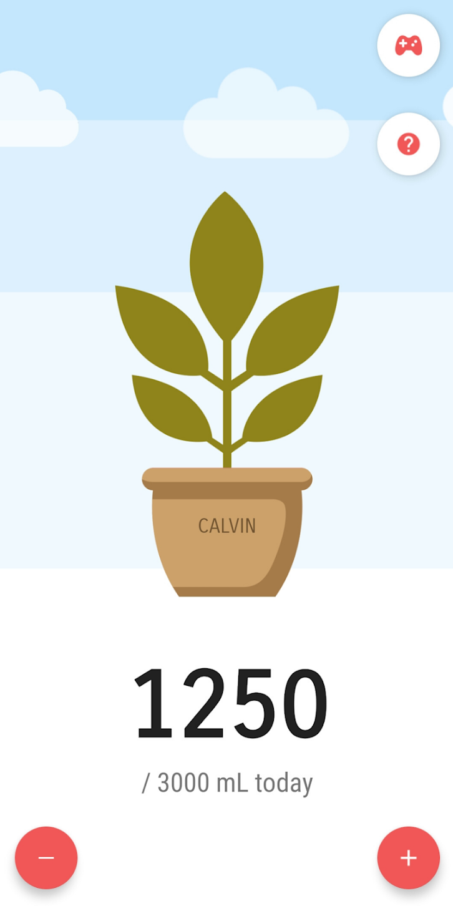
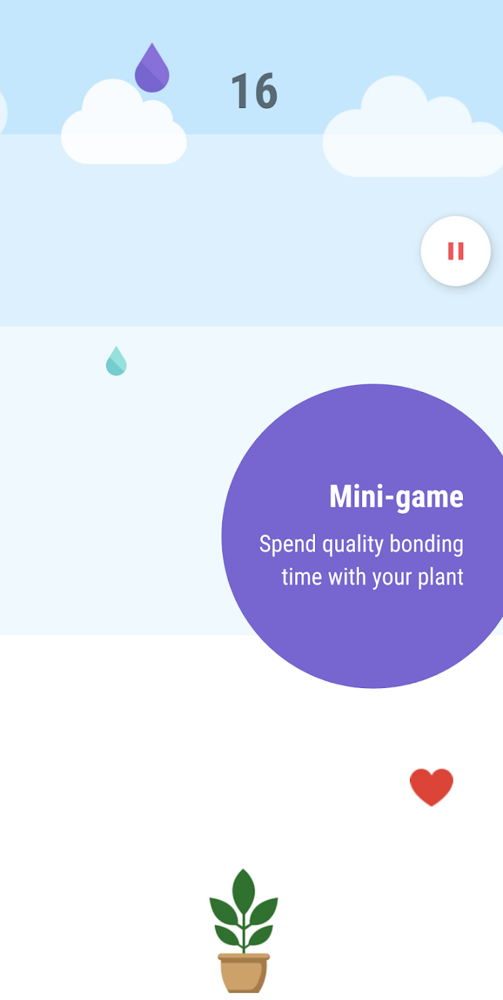
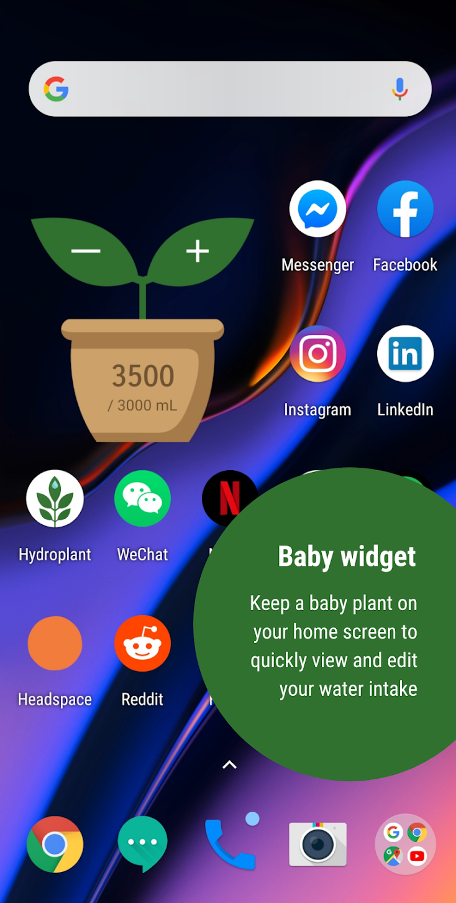

## Hydroplant
A simple hydration-tracking app and game made in Android Studio

### About
Need a reminder to stay hydrated?  
Introducing your new plant-friend! With Hydroplant, you'll embark on a journey of drinking water to reach your daily hydration goal. 
You can name your plant, play games together, and even add them to your home screen for quality bonding time :)
  
Check it out on the [Play Store](https://play.google.com/store/apps/details?id=gracegao.hydroplant)

### Quick Preview
Here's a glance at how it looks:  

### Contributing
Please feel free report bugs and add any ideas you like!
